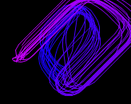
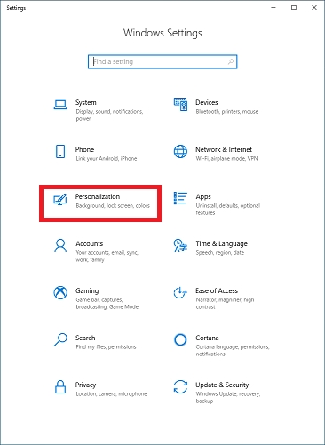
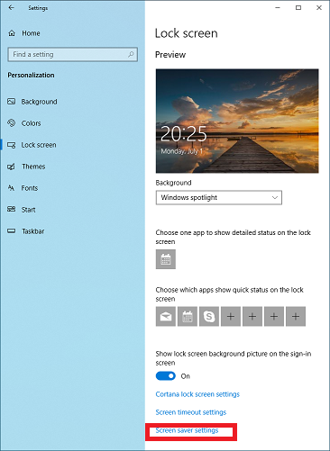
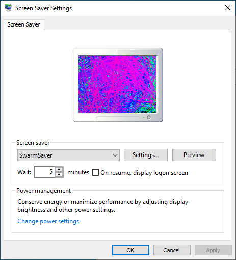
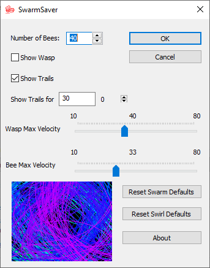

# SwarmSaver
Windows port and modification of the xswarm X11 screensaver

Jeff Butterworth's original xswarm depicted 'a bunch of little line segments chasing a randomly accelerating line segment'.  This has come to be taken as a swarm of bees chasing a wasp.

This simple windows screen saver is based on that original code with a few modifications, namely the color of the bees cycles through the rainbow, and the bees can leave trails, and the wasp can be hidden.

The basic 'swarm' settings will look something like this:  

The basic 'swirl' settings will look something like this:  
  
(This one can be quite mesmerizing on a large or multiple monitor display)

## Installation
Note:  the current release has only been tested on Windows 10 versions 1803 and 1903.  It may or may not work on older versions of windows

1. On a 64-bit system, copy SwarmSaver_x64.scr to the c:\windows\system32 directory.  On a 32-bit system, copy SwarmSaver_x86.scr to the c:\windows\system32 directory

2.  Right click on and empty space on the desktop and select personalization or go to all settings, and select personalization:  

3. Select 'Lock Screen' and then 'Screen saver settings':  

4. Select the 'SwarmSaver' screen saver, and set the desired wait time:  

5. Press 'Settings' to adjust the configuration as desired. ( I have mine set for the default swirl settings):  

## Release history
v1.0-1.0.8 are pretty much lost to the mists of time.  I originally started this back in 1995, and have slowly tweaked things over the years to use GDI+ and support multiple monitors.  
 
v1.0.9 First release to github.  Compile with VS2019, cleanup, add a 'Reset Swirl Defaults' option.